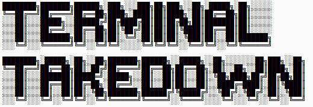

<div align="center">
  <a href="https://github.com/luca-hatu/Terminal-Takedown">
    
  </a>
</div>

# About this project
This is a basic terminal shooter game coded in Python. While trying to escape from space aliens, you must find a way to escape them and go home...

# How to play

<div align="center">
  <a href="https://github.com/luca-hatu/Terminal-Takedown">
    
  </a>
</div>
</br>
You can use your directional arrows to go left or right to either slip between the aliens or get a bonus. There are two types of enemies :

```
V
```
These are the normal aliens
``` 
W
```
These are fast, well-trained aliens.
You can also get a bonus which looks like this :
```
*
```
Your score and level are indicated in the top-left corner of the screen.
# How to download
You can get the installer from 
[here](executable/Terminal-Takedown_Installer.exe)

